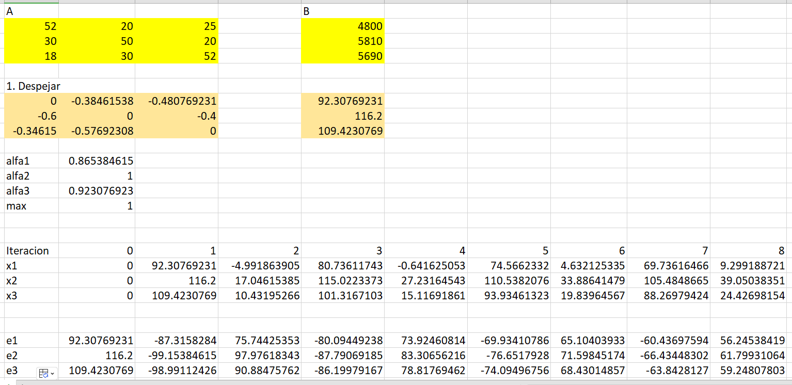
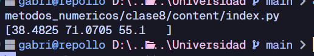

<h1 align='center'>📒 Tarea</h1>

    
    
    

Resolviendo el [problema anterior](../../clase7/content/README.md)
pero ahora con el método de Jacobi, se obtiene
el siguiente resultado:

### Hoja de Excel

    

El sistema converge muy lentamente, por lo
que en la hoja de Excel se puede observar
que se necesitan muchas iteraciones para
llegar a un resultado aceptable.

### Programa en Python

    

