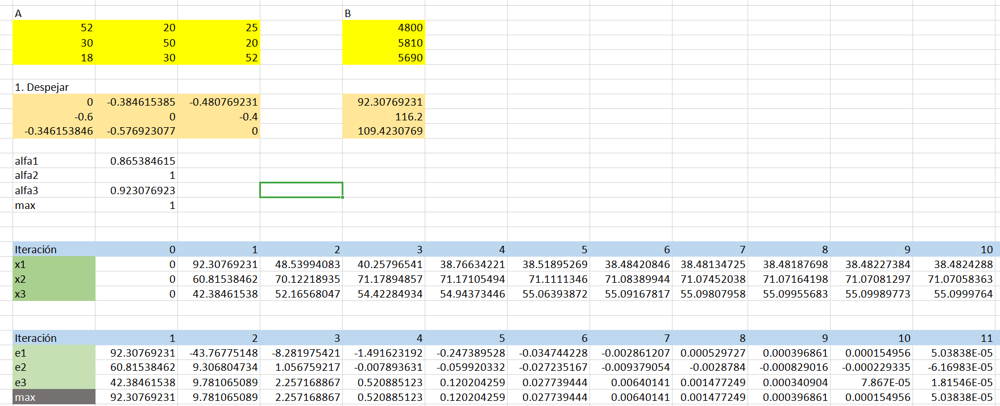

<h1 align='center'>📒 Tarea</h1>

    
    
    

Utilizando el sistema de la [tarea anterior](../../clase7/content/README.md),
se resuelve el sistema de ecuaciones lineales utilizando
el método _Gauss-Seidel_.

$$
A = \begin{bmatrix}
    52 & 20 & 25 \\
    30 & 50 & 20 \\
    18 & 30 & 52
\end{bmatrix}

\quad

B = \begin{bmatrix}
    4800 \\
    5810 \\
    5690
\end{bmatrix}
$$

### Resultado en Excel

    

En la imagen, la solución va convergiendo a medida que se aumenta el número de iteraciones.

### Resultado en Python

    

