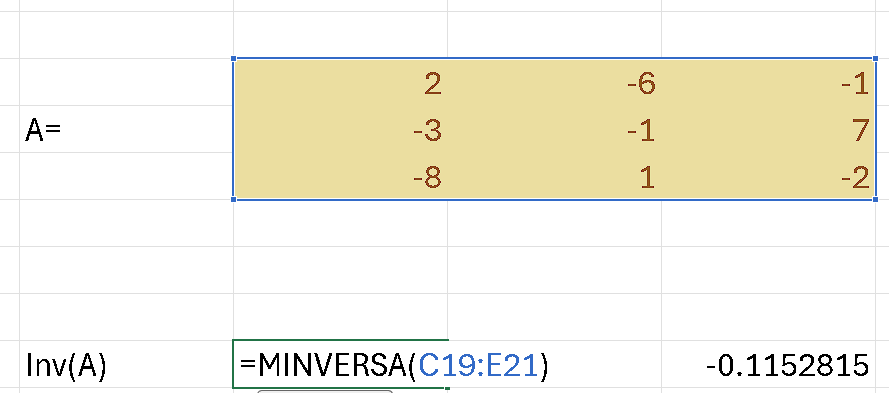
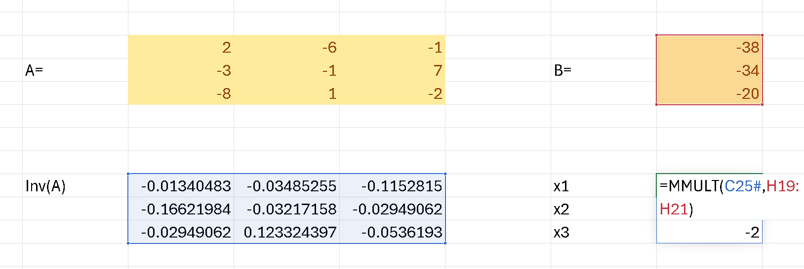

<h1 align='center'>Sistemas de ecuaciones</h1>

Para resolver un sistema de ecuaciones, recurrimos
a los métodos conocidos para resolver estos.

Sea $A \cdot x = B$, donde $A$ es una matriz de
coeficientes, $x$ es el vector de incógnitas y $B$
es el vector de términos independientes. Entonces,
para resolver el sistema, debemos dar con:

$$
x = A^{-1} \cdot B
$$

## Resolviendo en execel

Si tengo separado en una matriz los elementos $A$ y $B$.

Entonces saco la inversa de $A$ con la función `MINVERSE`.

Y finalmente, multiplico la inversa de $A$ por $B$.

Con ese resultado, tendremos una matriz que
representa los valores de cada una de las variables.
