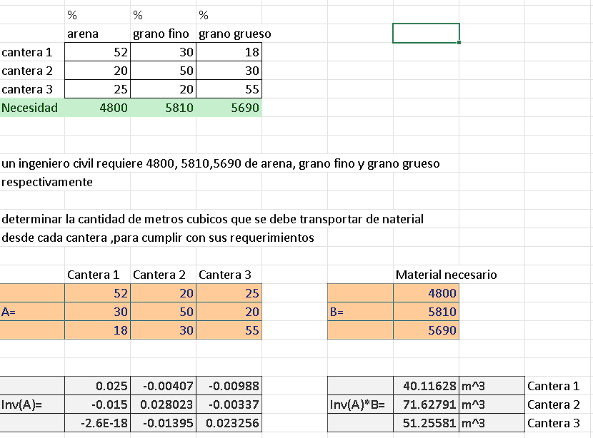
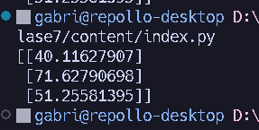

<h1 align='center'>📒 Tarea</h1>

<p align='center'>
    <a href='../README.md'>
        
    </a>
    <a href='./index.xlsx'>
        
    </a>
    <a href='./index.py'>
        
    </a>
</p>



Dando como resultado final lo siguiente:

- $40.11628 [m^3]$ para la cantera 1
- $71.62791 [m^3]$ para la cantera 2
- $51.25581 [m^3]$ para la cantera 3

## Programa en Python

```python
import numpy as np

A = [[52, 20, 25], [30, 50, 20], [18, 30, 55]]
B = [[4800], [5810], [5690]]

# invierte la matriz A
A_inv = np.linalg.inv(A)
# multiplica la matriz inversa por la matriz B
X = np.dot(A_inv, B)
# muestra el resultado
print(X)
```


